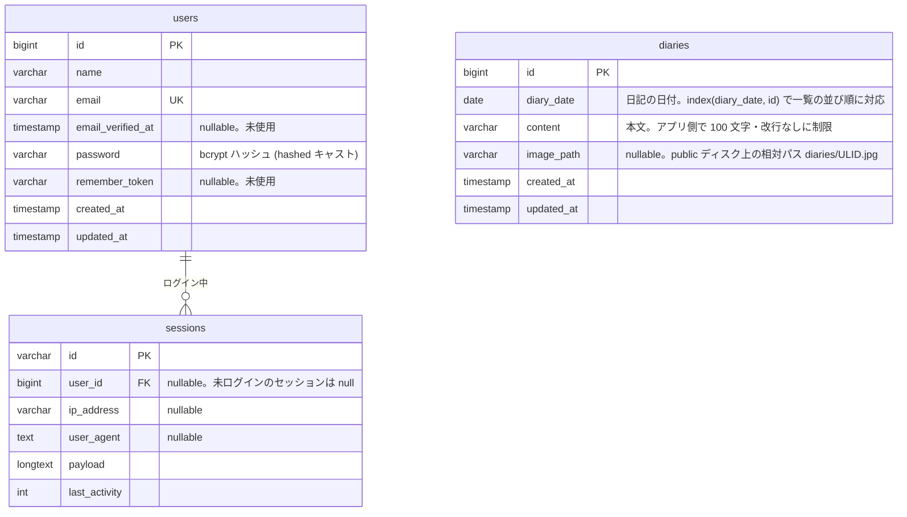

# 1行日記サイト 設計計画書

作成日: 2026-09-03 / 状態: **機能実装完了（#1〜#8、#15、#21、#22）。#9 デザイン適用はデザイン待ち。手順書は `docs/SETUP.md`、提出情報は `README.md`**

## 1. 課題要件（原文の要約）

| 区分 | 要件 |
|---|---|
| ページ | 一覧 / 新規投稿 / 編集 |
| 機能 | 一覧は5件ごとにページネーション / 日記ごとに jpg 画像1枚 / 一覧に画像表示 / 削除 |
| 環境 | PHP 最新リリース / MySQL 最新リリース / Laravel |
| その他 | HTML・CSS は最低限 / 未記載仕様は自己判断 / GitHub 等のリポジトリ URL で提出 / **開始時に最初のコミットを作ってから開発** / AI 利用の申告 |

## 2. バージョン選定（2026-09-03 に Docker Hub / Packagist / 公式ドキュメントで実測）

| 対象 | 採用 | 根拠 |
|---|---|---|
| PHP | **8.5.10**（`php:8.5.10-fpm-alpine`） | Docker Hub 公式イメージの最新安定版。8.4 系は 8.4.25 |
| MySQL | **26.7.0（Innovation、`mysql:26.7.0` にパッチまで固定）** ※決定。LTS 系列 9.7.2 でも migrate・seed・テスト 46 件が通ることを確認（2026-09-03、使い捨てコンテナで実施） | Docker Hub `mysql:latest` = `innovation` = 26.7.0（8/18 に 26.7.1 リリース済）。`mysql:lts` = 9.7.2。MySQL 公式マニュアル「Innovation 系列 = 26.7、LTS 系列 = 9.7」 |
| Laravel | **13.x**（framework v13.30.1、skeleton v13.10.1、2026-09-01 時点） | PHP `^8.3` 要件。公式 CI は PHP 8.3/8.4/8.5 × `mysql:9.7` でテスト |
| Composer | 2 系（`composer:2` イメージから同梱） | |
| Web サーバ | nginx（`nginx:1-alpine`） | php-fpm と分離する一般的構成 |

MySQL の判断材料:
- 「最新リリース Ver.」を文字通り取ると **26.7**（`mysql:latest`）。
- Laravel 本体の CI が回っているのは **9.7 LTS**。26.7 は Laravel 側の動作保証外だが、Innovation の差分は追加機能中心で CRUD 用途では問題が出る可能性は低い。
- 推奨: **26.7 を採用**し README に「最新リリース = Innovation 26.7 を採用。LTS 9.7 でも動作確認」と明記（compose のタグ 1 行で切替可能なので両方で動作確認する）。

## 3. リポジトリ構成

- `hana-prime-diary-test/` 自体を **独立 git リポジトリ** にする（親 `passive_income` リポには `.gitignore` に `/hana-prime-diary-test/` を追記して除外。fsns_mobile 等と同方式）。
- Laravel アプリは **リポジトリ直下**（`app/` サブディレクトリにしない）。審査者が `composer` プロジェクトとして標準構成で読めるようにする。
- Docker 関連は `compose.yaml`（ルート）+ `docker/` に集約。**共有 Traefik には依存しない**（審査者環境で `docker compose up` だけで動くこと最優先。`proxy-net` 外部ネットワークが無いと起動失敗するため）。
- ブランチ: `main`。コミットは機能単位で細かく（審査者がコミット履歴で進め方を追えるように）。

```
hana-prime-diary-test/
├── compose.yaml                # name: hana_prime_diary_test を明示
├── docker/
│   ├── php/Dockerfile          # php:8.5.10-fpm-alpine + pdo_mysql + composer、UID/GID 引数
│   ├── php/php.ini             # upload_max_filesize 10M / post_max_size 12M
│   └── nginx/default.conf      # root public/, client_max_body_size 12m
├── docs/DESIGN.md              # 本書（設計計画・仕様判断・開発フロー）
├── docs/SETUP.md               # 環境構築手順（#10）
├── README.md                   # セットアップ手順・仕様・AI 利用申告
└── (Laravel 標準構成: app/ routes/ resources/ database/ tests/ ...)
```

コミット計画:
1. `Initial commit`（README 見出し + .gitignore のみ。「開発前に最初のコミット」要件を満たす）
2. Docker 環境（compose / Dockerfile / nginx）
3. Laravel 13 スケルトン導入（`composer create-project`）、不要な Vite/Node 依存を除去し素の CSS に
4. マイグレーション・モデル・ファクトリ
5. 一覧 + ページネーション
6. 新規投稿（画像アップロード含む）
7. 編集（画像差替・画像削除）
8. 削除
9. Feature テスト
10. README 整備（手順・仕様判断・AI 利用申告）

## 4. ローカル環境（Docker Compose）

| サービス | イメージ | ホスト公開 | 備考 |
|---|---|---|---|
| web | nginx:1-alpine | **8081** | `infra/registry.yml` web_laravel 帯の空き番号 |
| app | 自前 Dockerfile（php 8.5.10-fpm-alpine） | なし | ソースを bind mount、UID 1000 で実行し権限問題を回避 |
| db | mysql:26.7.0 | **3327** | named volume `hana_prime_diary_test_db_data`。初期化 SQL でテスト用 DB `diary_test` も作成 |
| node | node:24-alpine（`build` プロファイル専用、通常は起動しない） | なし | Tailwind CSS 4 の CLI ビルド。出力 `public/css/app.css` をコミット（#26） |

- 台帳 `infra/registry.yml` に `dir: hana-prime-diary-test / name: hana_prime_diary_test / ports {web: 8081, mysql: 3327} / domains: []` を追記し `make doctor` で衝突ゼロ確認。
- 共有 Traefik・phpMyAdmin・node コンテナは **付けない**（提出物を最小に保つ）。DB を GUI で見たい場合はホストの 3327 に直結。
- ホストの uid/gid が 1000 以外の Linux では、最初の起動前に `.env` を用意して `UID=` / `GID=` を書く（compose が変数展開に使う）。手順は `docs/SETUP.md`。
- `.env` は Claude が **自動生成・編集しない**。審査者向けには `composer run setup` が `.env.example` からコピーする。開発中の `.env` 作成と `APP_KEY` 生成はユーザーが実行した。
- 審査者向け起動手順（README に記載予定）:
  ```bash
  docker compose up -d --build
  docker compose exec app composer run setup   # composer install / .env 作成 / key:generate / migrate / storage:link
  docker compose exec app php artisan db:seed  # 持ち主アカウント + ダミー 12 件
  # http://localhost:8081
  ```
  手順の全文は `docs/SETUP.md`。

## 5. 仕様（未記載事項の自己判断）

### 5.1 データモデル `diaries`

| カラム | 型 | 制約 | 説明 |
|---|---|---|---|
| id | bigint unsigned | PK | |
| diary_date | date | not null | 日記の日付（フォーム既定=今日、変更可） ※決定 |
| content | varchar(255) | not null | 本文。アプリ側で **最大 100 文字**・改行禁止（「1行」） |
| image_path | varchar(255) | nullable | `public` ディスク上の相対パス |
| created_at / updated_at | timestamp | | |

#### ER 図

アプリ固有のテーブルは `diaries` だけで、ログイン用に Laravel 標準の `users` と `sessions` を使う。持ち主 1 人の日記なので `diaries` は `user_id` を持たない（複数ユーザー化するときは `user_id` を追加して `users` に紐付ける）。



このほか Laravel 標準の `password_reset_tokens`、`cache` / `cache_locks`（CACHE_STORE=database）、`jobs` / `job_batches` / `failed_jobs`（QUEUE_CONNECTION=database）、`migrations` がある。いずれもアプリのコードからは直接使っていない。

### 5.2 画面・ルーティング（一覧は `/`、それ以外は `Route::resource('diaries', ...)`。`/diaries` は `/` へ 301）

| メソッド | パス | 名前 | 画面/処理 |
|---|---|---|---|
| GET | / | diaries.index | 一覧（トップページ）。新しい順（`diary_date` desc, `id` desc）。**5件ごと** `paginate(5)`。画像サムネイル表示。各行に「編集」「削除」 |
| GET | /diaries/create | diaries.create | 新規投稿フォーム（日付・本文・画像） |
| POST | /diaries | diaries.store | 保存 → 一覧へ redirect + フラッシュ「投稿しました」 |
| GET | /diaries/{diary}/edit | diaries.edit | 編集フォーム（現画像プレビュー、差替、「画像を削除」チェック） |
| PUT | /diaries/{diary} | diaries.update | 更新。画像差替時は旧ファイル削除 |
| DELETE | /diaries/{diary} | diaries.destroy | 削除（JS `confirm` で確認）。画像ファイルも削除 |
| GET | /diaries/{diary} | diaries.show | 詳細（公開）。画像を大きく表示。ログイン時は編集・削除の導線（#32） |
| GET / POST | /login | login | ログインフォームと認証（1 分 5 回まで）。未ログインで書き込み系を開くとここへ転送 |
| POST | /logout | logout | ログアウト |

投稿・編集・削除（create / store / edit / update / destroy）は `auth` ミドルウェア付き。一覧の「編集」「削除」「新規投稿」の導線はログイン時だけ表示する。

### 5.3 バリデーション（FormRequest、日本語メッセージ）

- `diary_date`: required / date_format:Y-m-d（`<input type="date">` の送信値は Y-m-d 固定のため）
- `content`: required / string / max:100 / 改行を含まない（正規表現 or カスタムルール）
- `image`: nullable / file / `mimes:jpg,jpeg` / `mimetypes:image/jpeg`（拡張子偽装対策に実 MIME も検査）/ max:5120 KB
- 編集時 `remove_image`: boolean

### 5.4 画像保存

- `storage/app/public/diaries/{ULID}.jpg` に保存し `php artisan storage:link` で `public/storage` から配信。
- 一覧は CSS で `max-width` を指定したサムネイル表示（リサイズ処理は行わない = 「最低限」の範囲）。
- 削除・差替時にファイルも消す（Model の `deleted` イベントで DB 削除の成功後に消す + update 時は DB 保存後に旧ファイルを削除）。

### 5.5 その他の判断

- **ログイン機能あり**（2026-09-03 に変更）。一覧は公開、投稿・編集・削除は持ち主（ログイン済み）だけ。第三者が勝手に変更できないようにするための未記載仕様の判断。ユーザー登録画面は作らず、シーダーで持ち主を 1 人作る。ログイン試行は 1 分 5 回まで
- 表示言語は日本語（`APP_LOCALE=ja`、`APP_TIMEZONE=Asia/Tokyo`）。
- テーマは「開発者の 1 行日記」。サイト名は **ひとこと開発日誌**。データ構造と機能は課題どおりで、名前・例文・デザイン（#9）だけを開発者向けに寄せる（2026-09-03 決定）。
- CSS は Tailwind CSS 4 を CLI でビルド（入力 `resources/css/app.css`、出力 `public/css/app.css` をコミット。審査者の Node 環境は不要）。デザインは Google Stitch で作成した 5 画面を基に、色トークンを `@theme` で定義して適用（#9）。仕様に無い要素のうち、シェア（X / Facebook / LINE / リンクのコピー）と前後の日記への導線は詳細ページに採用し、タグ・検索・月フィルタ・統計・状態バッジは置かない。画像が無い日記はダミー画像で形をそろえる。アイコンは使う分だけのインライン SVG。
- ページネーションは Laravel 標準の `links()` を最小の自作ビュー（Tailwind 非依存）で描画。
- テスト: Feature テスト（一覧5件区切り・投稿/編集/削除・画像アップロード `Storage::fake`・バリデーション）。DB は **compose 内 MySQL のテスト用 DB `diary_test`**（`phpunit.xml` で `DB_DATABASE=diary_test` を指定、`RefreshDatabase` 使用） ※決定。
- コード整形は Laravel Pint（同梱）。
- シーダー: `DatabaseSeeder` が持ち主ユーザー 1 人（`UserSeeder`、ログインに必要）と日記 12 件（`DiarySeeder`、ページネーション確認用）を投入する。

## 6. 提出物

- GitHub リポジトリ https://github.com/ud111/hana-prime-diary-test（public）
- README に「AI ツールの使用有無 / 名称 / 使用範囲」欄を設け、下記を記載する案:
  - 使用有無: あり
  - 名称: Claude Code（Anthropic、モデル Claude Fable 5.1）
  - 使用範囲: 設計計画書、Docker 環境、コードとテスト、PR のレビュー下書き、ドキュメントの作成に対話的に利用。仕様の判断、Issue 起票、PR 作成とレビュー指摘の採否、マージ、動作確認は本人が実施（README の申告文と同じ内容）

## 7. ヒアリング結果（2026-09-03）

| # | 項目 | 決定 |
|---|---|---|
| 1 | MySQL 系列 | **26.7 Innovation**（README に根拠明記、9.7 LTS でも動作確認） |
| 2 | GitHub リポジトリ | **ud111/hana-prime-diary-test（public）**。初回コミット後に作成済 |
| 3 | 認証 | なし（推奨案どおり）→ **#21 で「一覧は公開、書き込みはログイン必須」に変更** |
| 4 | 日付フィールド `diary_date` | **持たせる** |
| 5 | 本文の文字数上限 | 100 文字（推奨案どおり、異論なし） |
| 6 | 画像上限・編集時の画像削除 | 5MB / 削除チェックあり（推奨案どおり） |
| 7 | Feature テスト | **実装する。compose 内 MySQL の `diary_test` DB で実行** |
| 8 | `docs/DESIGN.md` の同梱 | 含める（推奨案どおり） |
| 9 | AI 利用申告文 | README に含める（推奨案どおり） |

## 8. 初回コミットについての注記

課題文「開始時に最初のコミットを作成してから開発を開始」は、コミット時刻が開発開始時刻とみなされる可能性がある。
そのため環境ファイルはローカルに作成済みだが **`git init` と初回コミットはユーザーの GO サインまで行わない**。
GO 後の手順: `git init -b main` → README/.gitignore で `Initial commit` → 環境ファイルをコミット → GitHub リポ作成・push → Laravel 導入。

## 9. 開発フロー（2026-09-03 決定）

- **Issue 駆動**: セクションごとに Issue を起票し Milestone「v1 提出」に紐付ける。
- **ブランチ**: Issue ごとに `feat/<番号>-<内容>`（例 `feat/5-diary-list`）。
- **PR**: 本文に `Closes #<番号>`。マージ方式は **Squash and merge** のみ（main は 1 Issue = 1 コミット、作業コミットは PR 側に残す）。マージ後ブランチ自動削除。
- **CI**: GitHub Actions で PR / main push ごとに Pint（`--test`）と PHPUnit（MySQL 26.7 サービスコンテナ、`diary_test` DB）を実行。
- **コミット規約**: Conventional Commits（`feat:` `fix:` `docs:` `ci:` `chore:`）。
- **デザイン**: 別途作成中（形式未定）。機能は素の HTML + 最小 CSS で先に完成させ、レイアウト 1 枚 + ページ別部分ビューに分けておき、到着後に Issue「デザイン適用」で一括反映する。

| Issue | 内容 |
|---|---|
| #1 | Docker 環境（PHP 8.5 / MySQL 26.7 / nginx）+ 設計書 |
| #2 | Laravel 13 導入と初期設定（ja / Asia/Tokyo / Vite 除去 / .env.example） |
| #3 | CI（Pint + PHPUnit on MySQL） |
| #4 | diaries テーブル・モデル・ファクトリ・シーダ |
| #5 | 一覧ページ + 5 件ページネーション |
| #6 | 新規投稿（jpg 画像アップロード） |
| #7 | 編集（画像差替・画像削除） |
| #8 | 削除（画像ファイルも削除） |
| #9 | デザイン適用 |
| #10 | README 仕上げ（手順・仕様判断・AI 利用申告）、`docs/SETUP.md`、MySQL 9.7 LTS 動作確認 |
| #15 | AI 駆動開発の設定（`CLAUDE.md`、`.claude/` のフック・スキル・サブエージェント。実際に使うものだけ） |
| #22 | Laravel Boost（MCP サーバーと公式スキルのみ。ガイドライン生成と `.ai/rules` は使わない。`.mcp.json` はコンテナ経由） |
| #21 | ログイン機能（一覧は公開、投稿・編集・削除は持ち主のみ。未記載仕様の判断） |
