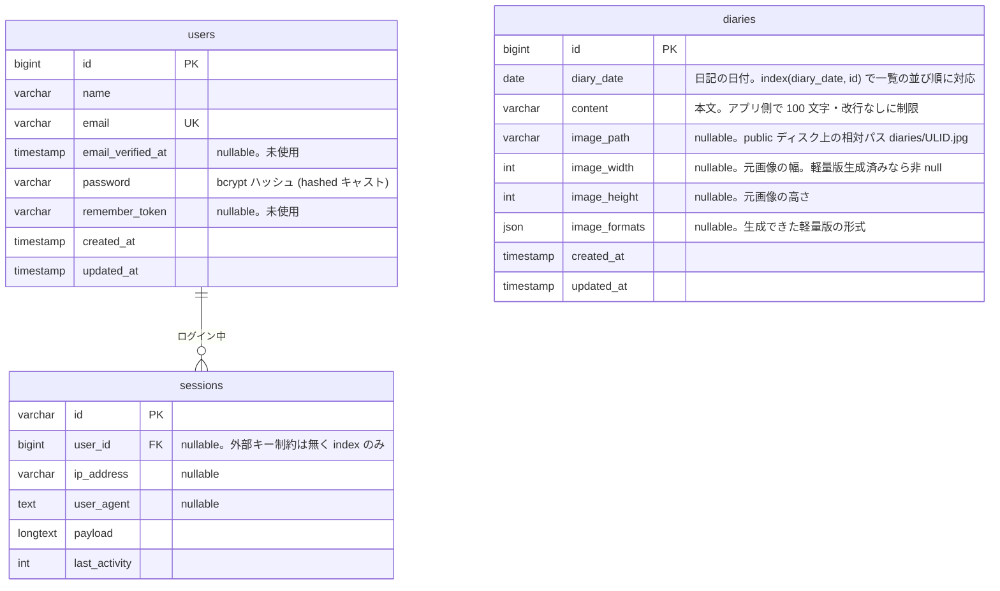

# 仕様

課題の要件と、記載の無かった部分をどう決めたかをまとめる。判断の理由や経緯は [DECISIONS.md](DECISIONS.md)、環境構築は [SETUP.md](SETUP.md)。

## 1. 課題の要件

| 区分 | 要件 |
|---|---|
| ページ | 一覧 / 新規投稿 / 編集 |
| 機能 | 一覧は 5 件ごとにページネーション / 日記ごとに jpg 画像 1 枚 / 一覧に画像表示 / 削除 |
| 環境 | PHP 最新リリース / MySQL 最新リリース / Laravel |
| その他 | HTML・CSS は最低限 / 未記載仕様は自己判断 / リポジトリ URL で提出 / 開始時に最初のコミットを作ってから開発 / AI 利用の申告 |

## 2. 画面とルーティング

一覧はトップページ `/`。それ以外は `Route::resource('diaries', ...)`。`/diaries` は `/` へ 301。

| メソッド | パス | 名前 | 内容 |
|---|---|---|---|
| GET | / | diaries.index | 一覧。日付の新しい順（同じ日付は後から登録した順）。5 件ごと。画像はサムネイル、無ければダミー画像 |
| GET | /diaries/{diary} | diaries.show | 詳細（公開）。大きな画像、シェア、前後の日記への導線 |
| GET | /diaries/create | diaries.create | 新規投稿フォーム（日付・本文・画像） |
| POST | /diaries | diaries.store | 保存してトップへ。フラッシュ「投稿しました」 |
| GET | /diaries/{diary}/edit | diaries.edit | 編集フォーム（現在の画像、差替、「画像を削除する」チェック） |
| PUT | /diaries/{diary} | diaries.update | 更新。画像差替時は旧ファイル削除 |
| DELETE | /diaries/{diary} | diaries.destroy | 削除（確認ダイアログ）。画像ファイルも削除 |
| GET / POST | /login | login | ログイン（試行はメールアドレスと IP ごとに 1 分 5 回まで） |
| POST | /logout | logout | ログアウト |
| GET | /robots.txt, /sitemap.xml | robots, sitemap | 検索エンジン向け（動的生成） |

- 一覧と詳細は誰でも見られる。投稿・編集・削除は `auth` ミドルウェア付きで、未ログインは `/login` へ転送し、ログイン後に元のページへ戻る。
- 一覧・詳細の「新規投稿」「編集」「削除」の導線はログイン時だけ表示する。
- 存在しない ID は 404。エラーページ（404 / 419 / 429 / 500）は日本語。

## 3. データモデル

| カラム | 型 | 制約 | 説明 |
|---|---|---|---|
| id | bigint unsigned | PK | |
| diary_date | date | not null | 日記の日付（フォームの既定は今日、変更可） |
| content | varchar(255) | not null | 本文。アプリ側で最大 100 文字・改行禁止 |
| image_path | varchar(255) | nullable | `public` ディスク上の相対パス `diaries/{ULID}.jpg` |
| image_width / image_height | int unsigned | nullable | 元画像の寸法。軽量版生成済みなら非 null |
| image_formats | json | nullable | 生成できた軽量版の形式（例 `["avif","webp"]`） |
| created_at / updated_at | timestamp | | |

インデックス: `(diary_date, id)`（一覧の並び順と前後の日記の検索に使う）。

### ER 図

アプリ固有のテーブルは `diaries` だけで、ログイン用に Laravel 標準の `users` と `sessions` を使う。持ち主 1 人の日記なので `diaries` は `user_id` を持たない（複数ユーザー化するときは `user_id` を追加して `users` に紐付ける）。

このほか Laravel 標準の `password_reset_tokens`、`cache` / `cache_locks`（CACHE_STORE=database）、`jobs` / `job_batches` / `failed_jobs`（QUEUE_CONNECTION=database）、`migrations` がある。いずれもアプリのコードからは直接使っていない。

## 4. バリデーション（FormRequest、日本語メッセージ）

- `diary_date`: required / `date_format:Y-m-d`（`<input type="date">` の送信値は Y-m-d 固定）
- `content`: required / string / max:100 / 改行を含まない（正規表現）。フォームはテキストエリアだが Enter は無効にし、貼り付けの改行は空白に置き換える
- `image`: nullable / file / `mimes:jpg,jpeg` / `mimetypes:image/jpeg`（拡張子偽装対策に実ファイルの MIME も検査）/ max:5120 KB / 縦横 6000px 以内（デコード時のメモリ対策）
- 編集時 `remove_image`: boolean。新しい画像と同時に指定された場合は新しい画像を優先
- ログイン: email / password 必須。失敗時はどちらが誤りか明かさない共通メッセージ

## 5. 画像

- 元の JPEG は `storage/app/public/diaries/{ULID}.jpg` に保存し、`storage:link` で `public/storage` から配信。ファイル名に利用者の入力は含めない
- 保存時に GD で幅 480 / 1200 の WebP と AVIF を生成し（EXIF の向きはピクセルに焼き込む）、`<picture>` で軽い形式から順に配信する。生成できた形式を `image_formats` に記録し、その形式だけ `<source>` を出す。元の JPEG は OGP に使う
- 画像には `width` / `height` を出す。一覧は遅延読み込み、詳細の主画像は優先読み込み
- 削除・差替時は DB の保存が成功してからファイル（軽量版含む）を消す。処理に失敗した場合は置いたファイルを消して入力エラーとして返し、差替では元の画像を残す
- 導入前の画像は元の JPEG のまま表示され、`php artisan diaries:regenerate-images` で軽量版を作れる
- 画像が無い日記は一覧でダミー画像（`public/images/no-image.svg`）を出す
- 投稿・編集画面では選んだ画像をその場でプレビューし、「選択を解除」で取り消せる（JS 無効時は従来どおり）

## 6. ログイン

- Laravel 標準のセッション認証。ユーザー登録画面は作らず、シーダーで持ち主を 1 人作る（`admin@example.com` / `password`。公開環境では変更する）
- ログイン時にセッション ID を再生成、ログアウト時にセッションを破棄して CSRF トークンを再生成
- 試行はメールアドレスと IP の組み合わせごとに 1 分 5 回まで（成功も数える）。超えると 429

## 7. SEO と共有

- 各ページに description、OGP、Twitter カード。詳細は本文が description、添付画像が OGP 画像（無ければ `public/images/ogp.png`）
- 公開ページには canonical（一覧は 2 ページ目以降も自己参照）。ログイン・投稿・編集は `noindex, nofollow`
- JSON-LD: 一覧に `WebSite`、詳細に `BlogPosting` と `BreadcrumbList`。`</script>` で抜け出せないようエスケープ
- `/robots.txt`（書き込み系とログインを Disallow、Sitemap の場所）と `/sitemap.xml`（トップと詳細。1 時間キャッシュし、日記の保存・削除で破棄）
- 絶対 URL は `APP_URL` から作る（Host ヘッダには依存しない）
- 詳細ページのシェアは X / Facebook / LINE の共有 URL とリンクのコピー。外部スクリプトは読み込まない

## 8. 表示

- 表示言語は日本語（`APP_LOCALE=ja`、`APP_TIMEZONE=Asia/Tokyo`）。サイト名は「ひとこと開発日誌」
- デザインは Google Stitch で作った 5 画面を基に Tailwind CSS 4 で実装。課題に無いタグ・検索・統計などは置かない
- フォントは Google Fonts の Inter と Noto Sans JP（読み込めない環境では system-ui）。アイコンは使う分だけのインライン SVG
- ページネーションは Laravel 標準の `links()` を自作ビューで描画（表示件数の案内付き）

## 9. シーダー

`php artisan db:seed` で持ち主ユーザー 1 人と、このサイトを作った開発の記録 14 件（うち 10 件は同梱画像付き。軽量版も生成）を投入する。同じ日付・本文があれば作らないので何度実行しても増えない。
